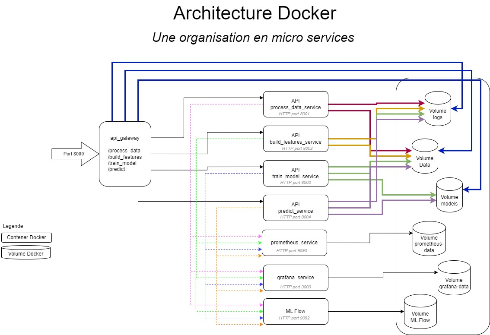

# London Fire Brigade MLOPS DataScienceTest Project

## Overview

This MLOps project aims to deploy a machine learning model to predict response times for the London Fire Brigade. It
utilizes the London Fire Brigade Incident Records dataset. The focus is on demonstrating a viable framework for ML model
deployment rather than just the model's performance.

### Repository Structure

- **scripts/**
    - `tests_api.sh` - Shell script for testing API endpoints.
- **src/**
    - **api/**
        - `main.py` - FastAPI application setup and route definitions.
    - **data/**
        - `data_preprocessing.py` - Functions for downloading and preprocessing data.
    - **features/**
        - `build_features.py` - Functions to build features from preprocessed data.
    - **model/**
        - `eval_model.py` - Placeholder script for evaluating model metrics.
        - `predict_model.py` - Functions for making predictions using the trained model.
        - `train_model.py` - Functions for training the model.
    - **utils/**
        - `config.py` - Configuration settings and paths.
- **tests/**
    - `test_data_processing.py` - Unit tests for data downloading and preprocessing functionalities.
    - `test_build_features.py` - Unit tests for feature engineering processes.
    - `test_train_model.py` - Unit tests for model training processes.
    - `test_predict_model.py` - Unit tests for prediction functionalities.
    - `test_api.py` - Unit tests for API endpoint functionalities.

### Main Components

#### API (`src/api/main.py`)

- Authentication, data processing, feature building, model training, and prediction endpoints.
- **Hard coded users for authentication: "admin": "fireforce", "user": "london123"**

#### Data Processing (`src/data/data_preprocessing.py`)

- Downloads, reads, filters, and processes incident and mobilisation data. Converts data to CSV or pickle formats.

#### Feature Building (`src/features/build_features.py`)

- Loads, cleans, merges, and stores features for modeling.

#### Model Operations (`src/model/`)

- `train_model.py`: Trains and saves a linear regression model.
- `predict_model.py`: Predicts attendance times using the trained model.
- `eval_model.py`: Placeholder script for model evaluation.

#### Configuration and Logging (`src/utils/config.py`)

- Central configuration for paths, URLs, and logging setup.

#### Unit Tests

- The project includes a comprehensive suite of unit tests located in the `tests` directory. These tests ensure the
  reliability and accuracy of each component of the system by testing data processing, feature engineering, model
  training, prediction logic, and API functionalities. The tests are designed to be run automatically via command line
  or integrated into continuous integration workflows such as GitHub Actions to facilitate continuous testing and
  validation throughout the development lifecycle.

## Datas

[London Fire Brigade Incident Records @ Kaggle](https://www.kaggle.com/datasets/mexwell/london-fire-brigade-incident-records?resource=download)

[Incidents Datasource ](
https://data.london.gov.uk/download/london-fire-brigade-incident-records/f5066d66-c7a3-415f-9629-026fbda61822/LFB%20Incident%20data%20from%202018%20onwards.csv.xlsx)

[Mobilistaion Datasource ](
https://data.london.gov.uk/download/london-fire-brigade-mobilisation-records/3ff29fb5-3935-41b2-89f1-38571059237e/LFB%20Mobilisation%20data%202021%20-%202024.xlsx)

## Scripts

### Data Processing Script Usage Guide

This guide covers the usage of the data processing script, designed to download, process, validate incident and
mobilisation data files, and optionally convert them to pickle format for optimized Python usage. You can run this
script directly from the command line or integrate it into an API for automated tasks.

#### Command Line Usage

The script can be run directly from the command line to process incident and mobilisation data files. You have the
option to specify which type of data to process, to process both by default, or to convert existing data files to pickle
format.

##### Syntax

The basic syntax to run the script is as follows:

```bash
python data_preprocessing.py [options]
```

##### Options

- `--type {incident,mobilisation}`: Specifies the type of data to download and process. You can choose either `incident`
  or `mobilisation`. If no type is specified, the script will process both types by default.
- `--convert-to-pickle`: Converts downloaded or existing CSV data files to pickle format, saving them in a specified
  directory. This option triggers the conversion of data files into pickle format instead of the default CSV processing.
  If specified without `--type`, it will convert all available CSV files.

##### Examples

1. **Process Both Data Types (Default)**

   If no specific type is provided, the script will process both incident and mobilisation data and convert them to
   pickle:

   ```bash
   python data_preprocessing.py
   ```

2. **Process Specific Data Type**

   To process only incident data:

   ```bash
   python data_preprocessing.py --type incident
   ```

   To process only mobilisation data:

   ```bash
   python data_preprocessing.py --type mobilisation
   ```

3. **Convert Data to Pickle Format**

   To convert all available data to pickle format after processing:

   ```bash
   python data_preprocessing.py --convert-to-pickle
   ```

#### API Integration

##### `/process_data` Endpoint

This endpoint processes either incident or mobilisation data based on the input parameters, with an optional conversion
to pickle format. It leverages background tasks to handle processing without delaying the response to the client.

###### Endpoint Details

- **URL**: `/process_data`
- **Method**: `GET`
- **Auth Required**: Yes (Basic HTTP Authentication)
- **Parameters**:
    - `incident`: Boolean, default is `false`. If `true`, processes incident data.
    - `mobilisation`: Boolean, default is `false`. If `true`, processes mobilisation data.
    - `convert_to_pickle`: Boolean, default is `false`. If `true`, converts processed data to pickle format.

###### Usage

The endpoint can be called with HTTP GET requests, providing the necessary parameters for data processing.
Authentication is required to access this endpoint, ensuring that only authorized users can initiate data processing
tasks.

###### Examples

1. **Process Incident Data Only**

   ```bash
   curl -X 'GET' \
     'http://127.0.0.1:8000/process_data?incident=true' \
     -u 'admin:fireforce' \
     -H 'accept: application/json'
   ```

2. **Convert Processed Data to Pickle Format**

   ```bash
   curl -X 'GET' \
     'http://127.0.0.1:8000/process_data?incident=true&mobilisation=true&convert_to_pickle=true' \
     -u 'admin:fireforce' \
     -H 'accept: application/json'
   ```

This integration allows for seamless operation between script-based data handling and API-driven interactions,
supporting a more automated and flexible workflow.

### Features Building Script Usage Guide

This guide details the usage of the `build_features.py` script, designed to load data, clean it, merge different data
sources, and finally save the resulting dataset for modeling. This script is a crucial step in the data preparation
phase of machine learning workflows.

#### Command Line Usage

The script is typically run from the command line and does not require any command-line arguments, simplifying its
execution.

##### Syntax

The basic syntax to run the script is as follows:

```bash
python build_features.py
```

This command will execute the feature building process using predefined settings specified in the script.

#### API Integration

##### `/build_features` Endpoint

This endpoint triggers the feature building process which involves data cleaning, transformation, and merging to prepare
it for model training. It is designed to be used after data has been processed and is ready to be transformed into a
format suitable for machine learning.

###### Endpoint Details

- **URL**: `/build_features`
- **Method**: `GET`
- **Auth Required**: Yes (Basic HTTP Authentication)

###### Usage

To initiate the feature building process through the API, an authenticated GET request is made to the endpoint. This
method allows the process to be integrated into larger workflows, such as continuous integration pipelines or automated
data handling systems.

###### Examples

1. **Trigger Feature Building**

   ```bash
   curl -X 'GET' \
     'http://127.0.0.1:8000/build_features' \
     -u 'admin:fireforce' \
     -H 'accept: application/json'
   ```

This endpoint provides an automated way to build features through an API call, ensuring that data preparation can be
seamlessly integrated into broader MLOps practices.

##### Error Handling

Errors during the feature building process are logged and raised as exceptions, ensuring that any issues are documented
and can be addressed promptly. This robust error handling is crucial for maintaining data integrity and reliability in
automated systems.

### Model Training Script Usage Guide

This guide outlines the usage of the `train_model.py` script, designed for training a machine learning model. This
script handles the training of a linear regression model using the prepared features, evaluates its performance, and
saves the model along with its encoder for future predictions.

#### Command Line Usage

The script can be run from the command line, allowing you to specify paths to the dataset, model, and encoder. This
flexibility makes it suitable for different environments and dataset configurations.

##### Syntax

The basic syntax to run the script is as follows:

```bash
python train_model.py [options]
```

##### Options

- `--data_path {path}`: Specifies the path to the dataset CSV file. This is where the script will read the data to be
  used for training.
- `--model_path {path}`: Specifies the path where the trained model should be saved.
- `--encoder_path {path}`: Specifies the path where the encoder used for preprocessing categorical variables should be
  saved.

##### Examples

1. **Train Model with Custom Paths**

   To specify custom paths for the dataset, model, and encoder:

   ```bash
   python train_model.py --data_path '/path/to/data.csv' --ml_model_path '/path/to/model.pkl' --encoder_path '/path/to/encoder.pkl'
   ```

#### API Integration

##### `/train_model` Endpoint

This endpoint handles the training of the model directly through an API call, allowing the parameters for the model
training to be specified through a POST request. It integrates seamlessly into a continuous deployment pipeline or any
automated machine learning workflow.

###### Endpoint Details

- **URL**: `/train_model`
- **Method**: `POST`
- **Auth Required**: Yes (Basic HTTP Authentication)
- **Request Body**:
    - `data_path`: Path to the dataset CSV file.
    - `model_path`: Path to save the trained model.
    - `encoder_path`: Path to save the encoder.

###### Usage

This endpoint is designed for users who wish to train the model directly via the API, providing flexibility in
specifying paths dynamically.

###### Examples

1. **Train Model Via API**

   ```bash
   curl -X 'POST' \
     'http://127.0.0.1:8000/train_model' \
     -u 'admin:fireforce' \
     -H 'Content-Type: application/json' \
     -d '{
       "data_path": "/path/to/data.csv",
       "ml_model_path": "/path/to/model.pkl",
       "encoder_path": "/path/to/encoder.pkl"
     }'
   ```
   
   exemple:
   ```bash
   curl -X 'POST' \
     'http://127.0.0.1:8000/train_model' \
     -u 'admin:fireforce' \
     -H 'Content-Type: application/json' \
     -d '{
       "data_path": "./data/global_data.csv",
       "ml_model_path": "./models/linear_regression_model.pkl",
       "encoder_path": "./models/onehot_encoder.pkl"
     }'
   ```

This API endpoint facilitates the on-demand training of models, making it an integral part of MLOps strategies that
prioritize automation and flexibility.

##### Error Handling

The script and API endpoint are designed with robust error handling to ensure that any issues during the model training
process are logged and addressed, providing detailed error messages to aid in troubleshooting.

### Model Prediction Script Usage Guide

This guide explains the usage of the `predict_model.py` script, designed to make predictions using a pre-trained model.
This script loads the necessary model and encoder, prepares the input features, and performs predictions based on input
parameters.

#### Command Line Usage

The script allows command-line interactions where you can specify input parameters directly, ideal for testing or
one-off predictions.

##### Syntax

The basic syntax to run the script from the command line is as follows:

```bash
python predict_model.py [options]
```

##### Options

- `--distance {float}`: Specifies the distance to the incident in kilometers. This is a required input for making
  predictions.
- `--station {string}`: Specifies the name of the fire station. This is another required input for the prediction.

##### Examples

1. **Predict Attendance Time**

   To make a prediction using specific input parameters:

   ```bash
   python predict_model.py --distance 5.2 --station 'Acton'
   ```

#### API Integration

##### `/predict` Endpoint

This endpoint facilitates predictions using the trained model, directly through an API call. It is designed for dynamic
interaction, allowing users to specify the input parameters via a GET request, which are then used to return a
prediction.

###### Endpoint Details

- **URL**: `/predict`
- **Method**: `GET`
- **Auth Required**: Yes (Basic HTTP Authentication)
- **Parameters**:
    - `distance`: A float that represents the distance to the incident in kilometers.
    - `station`: A string that represents the name of the departing fire station.

###### Usage

This endpoint allows external systems to make predictions by submitting a simple GET request with the necessary
parameters.

###### Examples

1. **Make a Prediction via API**

   ```bash
   curl -X 'GET' \
     'http://127.0.0.1:8000/predict?distance=5.2&station=Acton' \
     -u 'admin:fireforce' \
     -H 'accept: application/json'
   ```

This allows for seamless integration into an operational environment, enabling real-time prediction capabilities for
systems interacting with the MLOps infrastructure.

##### Error Handling

Both the script and API endpoint include comprehensive error handling mechanisms to ensure robust operation. Errors
during prediction due to model loading failures, data preparation issues, or during the prediction itself are logged and
reported. This helps maintain high reliability and provides clarity in operational settings.

## Unit Test Documentation

This guide provides an overview of the unit tests for the MLOps project. It lists each test file, explains its purpose,
and describes how to run the tests.

### Test Files and Their Purposes

Each component of the project has a dedicated test file located in the `tests` directory at the root of the project.
Here’s what each file is responsible for:

#### 1. `test_data_processing.py`

- **Purpose**: Tests functions related to downloading, validating, and preprocessing data. This includes checking file
  integrity, correct data filtering, and format conversions.

#### 2. `test_build_features.py`

- **Purpose**: Ensures that features are correctly constructed from the processed data. Tests cover data loading,
  cleaning, merging, and feature calculation.

#### 3. `test_train_model.py`

- **Purpose**: Verifies that the model training process functions correctly. Tests check that the model trains without
  errors and evaluates the outputs such as model files and performance metrics.

#### 4. `test_predict_model.py`

- **Purpose**: Tests the prediction functionality of the trained model. This includes loading the model, preparing
  features for prediction, and ensuring that the predictions are accurate.

#### 5. `test_api.py`

- **Purpose**: Ensures that all API endpoints are functioning correctly. Tests check endpoint accessibility, request
  handling, authentication, and response correctness.

### Running the Tests

#### Command Line Execution

To run all unit tests from the command line, navigate to the root directory of the project and execute the following
command:

```bash
python -m unittest discover -s tests
```

This command will discover all test files in the `tests` directory and execute them.

### Running Tests via GitHub Actions / CI / CD

To run these tests automatically via GitHub Actions, include the following steps in your `.github/workflows/main.yml`
file:
NOT TESTED

```yaml
name: Python application

on: [ push, pull_request ]

jobs:
  build:
    runs-on: ubuntu-latest
    steps:
      - uses: actions/checkout@v2
      - name: Set up Python
        uses: actions/setup-python@v2
        with:
          python-version: '3.8'
      - name: Install dependencies
        run: |
          python -m pip install --upgrade pip
          pip install -r requirements.txt
      - name: Run tests
        run: |
          python -m unittest discover -s tests
```

This workflow configures GitHub Actions to install Python, install all necessary dependencies, and then run the unit
tests whenever changes are pushed or pull requests are made to the repository.

## Logging Framework Documentation

This guide provides an overview of the logging framework implemented within the project. The logging setup is designed
to capture detailed logs across different modules of the application, ensuring that all significant events, errors, and
system information are recorded for troubleshooting and monitoring purposes.

### Overview

The project utilizes Python's built-in `logging` library to set up a robust logging system. Each major component of the
application (data processing, feature building, model training, prediction, and API) has its own dedicated logger and
log file, which helps in isolating logs by functionality and simplifying troubleshooting.

### Configuration

#### Log Files

Each component of the system writes logs to a separate file. Here are the log files used in the project:

- `data_preprocessing.log` - Logs all events related to the data preprocessing tasks.
- `build_features.log` - Captures logs concerning the feature building processes.
- `train_model.log` - Stores logs related to model training sessions.
- `predict_model.log` - Logs details during the prediction operations.
- `eval_model.log` - Used exclusively for logging the model evaluation processes.
- `api.log` - Captures all logs generated from API interactions and operations.

#### Log File Location

All log files are stored in a directory specified by the `log_directory` configuration parameter. The default path is
set to `../../logs`, relative to the main application directory.

#### Log Rotation

To prevent log files from consuming excessive disk space, a rotating file handler is configured for each log file. The
rotation criteria are based on file size, with each log file allowed to grow up to 1 MB before being rotated. Up to five
old log files are kept as backups.

#### Logging Levels

The logging level for each component is configurable. The default level is set to `DEBUG` for all components, ensuring
that all debug, info, warning, error, and critical messages are captured.

### Log Format

The log messages are formatted to include the timestamp, logger name, log level, and the message. The format used is:

```
%(asctime)s - %(name)s - %(levelname)s - %(message)s
```

This format provides clarity and consistency across all logs, making it easier to read and understand the chronological
sequence of events and actions taken by the system.

### Parameters

Key parameters configured in the `config.py` file include:

- `LOG_MODE`: Specifies the mode for log file opening, set to 'a' for appending to ensure logs are not overwritten.
- `DEFAULT_LEVEL`: The default logging level set for all loggers unless specifically overridden.
- `CONSOLE_LEVEL`: Determines the logging level for console outputs, useful during development or debugging sessions.
- `HISTORY_LEVEL`: Controls the logging level for a separate historical log that aggregates important events.

### Custom Warning Handler

The project also includes a custom warning handler that redirects all warnings generated by the application to the
appropriate logs, ensuring that they are not missed and are recorded in the same format as other log messages.

### Usage

The logging framework is integrated throughout the application code, with loggers instantiated and used in each major
component. Developers can easily add new log messages or adjust logging levels as needed to enhance diagnostics or
handle new features.

Here's a detailed documentation for the `config.py` script used in the project, focusing on the parameters it manages.

## Configuration Parameters Guide

This guide outlines the parameters defined in the `config.py` file used throughout the project. The `config.py` script
centralizes configuration settings, providing a single point of reference for managing paths, URLs, and other
system-wide settings. This approach ensures that changes to the configuration are reflected across all components of the
application.

### Overview of Configuration Parameters

The `config.py` file contains various parameters used by different modules for tasks such as data handling, logging, and
API configuration. Below is a detailed explanation of each parameter:

#### Data and Model Paths

- `chemin_data`: Path to the directory where raw data files are stored. Default is `../../data`.
- `chemin_data_ref`: Path to the directory for reference data or processed data. Default is `../../data/ref`.
- `chemin_model`: Path to the directory where models and encoders are stored. Default is `../../models`.

#### URL Resources

- `url_incident`: URL to download the incident data from the London Fire Brigade records.
- `url_mobilisation`: URL for downloading mobilisation data from the London Fire Brigade records.

#### File Names

- `fichier_incident`: Name of the file for incident data, typically saved as `incident_data.csv`.
- `fichier_mobilisation`: Name of the file for mobilisation data, saved as `mobilisation_data.csv`.
- `fichier_stations`: File name for station data, referred to as `stations.csv`.
- `fichier_calendrier`: Calendar file name, not specifically detailed in usage.
- `fichier_vehicle`: Vehicle data file name, not detailed in usage.
- `fichier_global`: Global data file that may be used for combined datasets or outputs.
- `fichier_model`: The default file name for storing the trained model, typically a `.pkl` file like
  `linear_regression_model.pkl`.

#### Logging Configuration

- `log_directory`: Directory path where log files are stored. Default is `../../logs`.

#### Data Processing and Feature Engineering

- `years`: A list of years relevant for filtering or processing data. Example: `[2022, 2023]`.
- `incident_expected_columns`: A list defining the expected columns in the incident data to validate data integrity.
- `mobilisation_expected_columns`: Similar to `incident_expected_columns`, for mobilisation data.

#### Model Training

- `BandWidth_speed_min`: Minimum threshold for speed calculation in feature engineering.
- `BandWidth_speed_max`: Maximum threshold for the same.
- `BandWidth_AttendanceTimeSeconds_min`: Minimum attendance time in seconds for filtering in feature preparation.
- `BandWidth_AttendanceTimeSeconds_max`: Maximum attendance time for the same.

#### Logging Levels and Modes

- `LOG_MODE`: Defines the file mode for log files, typically set to 'a' for appending.
- `DEFAULT_LEVEL`, `CONSOLE_LEVEL`, and `HISTORY_LEVEL`: Define the logging levels used across different outputs (file,
  console, and historical logs).

#### Prometheus and Pushgateway Setup
- `PUSHGATEWAY_URL` sets the URL of the Pushgateway.
- `PUSH_GETAWAY_ENABLED` enables or disables the metrics logging.

### Usage

These parameters are utilized across various scripts to standardize the data paths, file names, and other operational
settings, making it easier to maintain and modify the system as needed. For instance, changing the `chemin_data` will
automatically update the data paths in all scripts that import this configuration, facilitating easy relocations of data
storage without modifying each script individually.

## Prometheus Metrics Logging
### Overview
This project implements metrics logging using Prometheus and Pushgateway to monitor the performance and status of various scripts involved in data processing, model training, and prediction. Each script utilizes the MetricsLogger class from config.py to record and push metrics to a Pushgateway, which are then scraped by a Prometheus server for monitoring and analysis.

The metrics logging implemented in this project provides valuable insights into the operation of each script, aiding in monitoring, debugging, and optimizing the data processing and machine learning workflows. By pushing these metrics to a Prometheus server via Pushgateway, we can visualize and analyze the performance and status of our system in real-time.

#### Implementation Details

- Pushgateway Integration:

Each run of a script generates metrics that are pushed in a batch to the Pushgateway, from where the Prometheus server picks them up.

- Configuration:

`PUSHGATEWAY_URL` in `config.py` sets the URL of the Pushgateway.
`PUSH_GETAWAY_ENABLED` in `config.py` enables or disables the metrics logging.

Logging and Metrics: the **MetricsLogger** class extends the standard logging functionality to include metrics logging. Each log message can optionally include associated metrics that are recorded and pushed to the Pushgateway to be scraped by prometheus.

The code below demonstrates how to use the MetricsLogger to log messages and push metrics. Metrics are pushed **only if** the config parameter `PUSH_GETAWAY_ENABLED` is set to `True`.

```
from src.utils.config import LoggingMetricsManager
# Get the logger for model training
logging = LoggingMetricsManager().metrics_loggers['train_model']

# This line ALSO increments the info counter 
# in prometheus metrics if PUSH_GETAWAY_ENABLED is True
logging.info("train_model Logger loaded")

# Several metrics logging and increment of info counter
metrics = {
        MSE_METRIC: mean_squared_error(y_test, y_pred),
        # Other metrics
        MAX_ERROR_METRIC: max_error(y_test, y_pred)
    }
    
logging.info(f"Model Evaluation Metrics: {metrics}", 
    metrics=metrics,
    metric_types=['Gauge', 'Counter', 'Histogram', 'Gauge'])
```


### Setup

**Step 0:** Make sure `PUSH_GETAWAY_ENABLED` is set to `True` and `PUSHGATEWAY_URL` address and port is correct

**Step 1:** Run pushgateway through docker

```bash
docker pull prom/pushgateway  
# check ports
docker run -d -p 9091:9091 prom/pushgateway
```
**Step 2:** Access pushgateway by naviagting batchs history: http://localhost:9091/#
and metrics list: http://localhost:9091/#metrics

**Step 3:** Run Prometheus locally (needs install before) with the command **(TEMPORARY UNTIL DOCKERISATION IS DONE)**:
```bash
prometheus --config.file=/your_path_to/mlops_london_firebrigade/scripts/prometheus.yml --storage.tsdb.path=/your_path_to/mlops_london_firebrigade/data/prometheus
```
**Step 4:** Access Prometheus

Once prometheus is running, you can access the Prometheus web UI by navigating to:
http://localhost:9090

From here, you can run all the scripts and use the Prometheus Expression Browser to run queries and view metrics being scraped by Prometheus during the batchs executions.

**Step 4:** Run Grafana locally 
```bash
docker run -d -p 3000:3000 --name=grafana grafana/grafana-enterprise
```
Once Grafana is up the you can navigate to:
http://localhost:3000

### Common Metrics

All scripts share common metrics related to logging at different severity levels. These metrics are counters that keep track of the number of log messages of each severity level encountered during a script run. This helps in monitoring the frequency and severity of events occurring in each script.

#### Log Message Counters:
- Metric Names: `{log_level}_logs_{module}`
- `log_level`: The severity level of the log message (info, warning, error, debug, critical).
- `module`: The name of the script/module (e.g., data_preprocessing, train_model).
- Metric Type: Counter
- Description: Counts the number of log messages at a specific severity level for each script.

**Note: Every time a log message is recorded, the corresponding counter metric is incremented, regardless of whether additional metrics are provided. The detailed messages are written to log files for reference in case of errors during batch processing.**

### Script-Specific Metrics

Each script may define additional metrics relevant to its specific operations. These metrics are defined through constants at the top of each script with a _METRIC suffix and are recorded using the optional metrics parameter of the MetricsLogger.

Below is a comprehensive list of all metrics logged by each script during a batch run, including the constants used, the resulting Prometheus metric names, their types, and detailed descriptions.

| Script  | Metric Name                                             | Metric Type | Description                                                                                           |
|---------|---------------------------------------------------------|-------------|-------------------------------------------------------------------------------------------------------|
| data    | success_incident_data_preprocessing                     | Gauge       | Indicates whether the processing of incident data was successful (1 for success, 0 for failure).      |
|         | success_mobilisation_data_preprocessing                 | Gauge       | Indicates whether the processing of mobilisation data was successful (1 for success, 0 for failure).  |
|         | download_size_in_bytes_{filename}_data_preprocessing    | Gauge       | Total size in bytes of the file to be downloaded for a specific data type (incident or mobilisation). |
|         | downloaded_bytes_{filename}_data_preprocessing          | Gauge       | Number of bytes actually downloaded for a specific data type.                                         |
|         | expected_bytes_{filename}_data_preprocessing            | Gauge       | Expected number of bytes to be downloaded for a specific data type.                                   |
|         | initial_count_{filename}_data_preprocessing             | Gauge       | Number of records in the dataset before filtering for a specific data type.                           |
|         | filtered_count_{filename}_data_preprocessing            | Gauge       | Number of records in the dataset after filtering for a specific data type.                            |
|         | record_saved_{filename}_data_preprocessing              | Gauge       | Number of records saved to the CSV file for a specific data type.                                     |
|         | download_duration_seconds_{filename}_data_preprocessing | Gauge       | Duration in seconds taken to download the file for a specific data type.                              |
|         | filter_duration_seconds_{filename}_data_preprocessing   | Gauge       | Duration in seconds taken to filter the data for a specific data type.                                |
| build   | incident_rows_build_features                            | Gauge       | Number of incident data rows loaded before cleaning.                                                  |
|         | mobilisation_rows_build_features                        | Gauge       | Number of mobilisation data rows loaded before cleaning.                                              |
|         | station_rows_build_features                             | Gauge       | Number of station data rows loaded.                                                                   |
|         | incident_cleaned_rows_build_features                    | Gauge       | Number of incident data rows after cleaning.                                                          |
|         | mobilisation_cleaned_rows_build_features                | Gauge       | Number of mobilisation data rows after cleaning.                                                      |
|         | saved_file_size_build_features                          | Gauge       | Size in bytes of the saved merged dataset CSV file.                                                   |
|         | success_build_features                                  | Gauge       | Indicates whether the feature building process was successful (1 for success, 0 for failure).         |
| train   | original_data_size_train_model                          | Gauge       | Size in bytes of the original dataset loaded for training.                                            |
|         | processed_data_size_train_model                         | Gauge       | Size in bytes of the dataset after preprocessing.                                                     |
|         | mse_train_model                                         | Gauge       | Mean Squared Error of the model on the test dataset.                                                  |
|         | r2_score_train_model                                    | Gauge       | R-squared score (coefficient of determination) of the model on the test dataset.                      |
|         | mae_train_model                                         | Gauge       | Mean Absolute Error of the model on the test dataset.                                                 |
|         | max_error_train_model                                   | Gauge       | Maximum residual error of the model on the test dataset.                                              |
| predict | num_features_predict_model                              | Gauge       | Total number of features used for making the prediction.                                              |
|         | prediction_result_predict_model                         | Gauge       | The predicted attendance time in seconds.                                                             |
|         | success_predict_model                                   | Gauge       | Indicates whether the prediction process was successful (1 for success, 0 for failure).               |
#### 5. api/main.py

While the API script primarily handles HTTP requests and orchestrates calls to other scripts, it also utilizes the MetricsLogger to record log message counters. Additional metrics can be added as needed to monitor API-specific events.

### MLflow Integration

#### Overview of Scripts

##### `config.py`

This script sets up the configuration parameters for the entire project. It includes paths for data storage, model storage, and logging configurations. It also defines the parameters for MLflow integration.

##### `train_model.py`

This script handles the training of machine learning models and logs the training process, model parameters, metrics, and artifacts to MLflow.

###### MLflow Integration

1. **Starting an MLflow Session**: At the beginning of the training process, an MLflow session is started by setting the tracking URI and specifying the experiment name.
2. **Logging Parameters and Metrics**: Model parameters and training metrics are logged to MLflow to keep track of the model's performance.
3. **Model and Encoder Logging**: The trained model along with its encoder is logged as an MLflow artifact, allowing versioning and easy deployment.
4. **Model Registration**: Post training, the model is registered in MLflow's model registry under a specified name, facilitating model management and version control.

##### `predict_model.py`

This script uses the trained models to make predictions. It can fetch the latest model from MLflow's model registry to ensure that the most recent and potentially the best-performing model is used.

###### MLflow Integration

1. **Loading Model from MLflow**: Depending on the configuration parameter `USE_MLFLOW`, the script either loads a locally saved model or fetches the latest model version from MLflow's model registry.
2. **Making Predictions**: Once the model is loaded, it is used to make predictions based on new input data.

#### Configuration Parameters

Ensure that the following parameters are properly set in `config.py` to enable MLflow integration:
- `USE_MLFLOW`: Boolean flag to toggle MLflow tracking on or off.
- `MLFLOW_TRACKING_URI`: Set this to the address of your MLflow tracking server, e.g., `http://localhost:5000`.
- `MLFLOW_EXPERIMENT_NAME`: Name the experiment appropriately to reflect the nature of the training or prediction tasks.

#### Setup Instructions

1. **Install Dependencies**: Ensure MLflow and all other required libraries are installed using `pip install mlflow pandas sklearn` 
2. `mlflow server --backend-store-uri sqlite:///mlflow.db --default-artifact-root ./mlflow-artifacts --host 0.0.0.0 --port 9092` to start the server 
2. **Configure MLflow**: Modify `config.py` to point to your MLflow server.
3. **Run Training**: Execute `python train_model.py` to train models and log information to MLflow.
4. **Run Prediction**: Execute `python predict_model.py` to make predictions using models managed in MLflow.

#### Conclusion

Integrating MLflow helps in managing the lifecycle of machine learning models effectively, from logging experiments to serving predictions using the best models. This project demonstrates a practical implementation of these capabilities.

## Dockerisation


In order to start building the images and activate the containers, go to the root of the project and run the following command:

```bash
docker-compose build
docker-compose up
```


